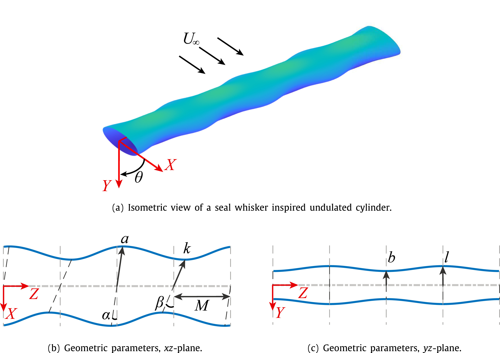

<Box sx={{ maxWidth: "500px", margin: "0 auto" }}>

</Box>

# Abstract

Inspired by the geometric properties of seal whiskers, the addition of spanwise undulations on a cylinder have been shown to lower the mean and oscillatory forces and modify the frequency of flow-induced vibration when compared to smooth cylinders. 
Previously, computational fluid dynamics (CFD) has been used to characterize the hydrodynamic response with respect to specific geometric features.
However simulations are time intensive due to complex three-dimensional meshing and computation time, limiting the number of geometric perturbations explored. 
A method is proposed in which the specific geometric features of this complex topography can be modified during a simulation thereby decreasing the time per geometric modification and removing the need for manual meshing of the complex structure. 
The surface of the seal whisker inspired geometry is parameterized into seven defining parameters, each of which is directly controlled in order to morph the surface into any realization within the defined parameter space. 
Once validated, the algorithm is used to explore the undulation amplitudes in the chord and thickness directions, by varying each independently from 0 to 0.3 thicknesses in increments of 0.05 at a Reynolds number of 500. 
The force and frequency response are examined for this matrix of geometric parameters, yielding detailed force trends not previously investigated. 
The impact of the bio-inspired morphing algorithm will allow for further optimization and development of force-mitigating underwater devices and other engineering applications in need of vibration suppression, frequency tuning, or force reduction.

# Citation
<Box sx={{ overflowX: 'auto', maxWidth: '100%', bgcolor: "greyBackground.main", borderRadius: 2, p: 2 }}>
```bibtex
@article{yuasa_simulations_2022,
  title = {Simulations of Flow over a Bio-Inspired Undulated Cylinder with Dynamically Morphing Topography},
  author = {Yuasa, Mikihisa and Lyons, Kathleen and Franck, Jennifer A.},
  year = {2022},
  month = may,
  journal = {Journal of Fluids and Structures},
  volume = {111},
  pages = {103567}
}
```
</Box>