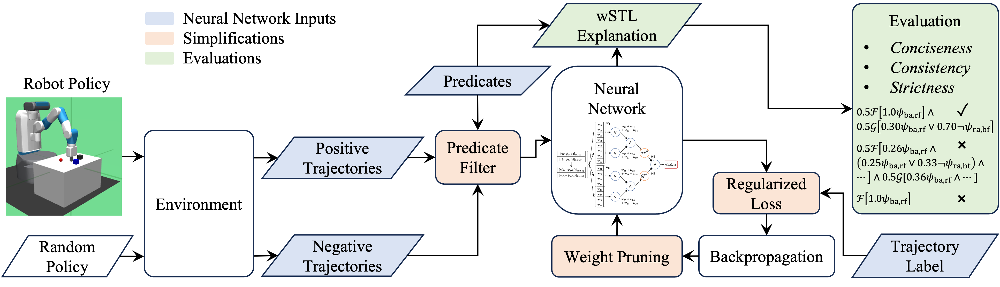

<Box sx={{ maxWidth: "800px", margin: "0 auto"}}>

</Box>

# Abstract
Neural network-based policies have demonstrated success in many robotic applications, but often lack human-explanability, which poses challenges in safety-critical deployments. 
To address this, we propose a neuro-symbolic explanation framework that generates a weighted signal temporal logic (wSTL) specification to describe a robot policy in a interpretable form. 
Existing methods typically produce explanations that are verbose and inconsistent, which hinders explainability, and loose, which do not give meaningful insights into the underlying policy. 
We address these issues by introducing a simplification process consisting of predicate filtering, regularization, and iterative pruning. We also introduce three novel explainability evaluation metrics -- conciseness, consistency, and strictness -- to assess explanation quality beyond conventional classification metrics. 
Our method is validated in three simulated robotic environments, where it outperforms baselines in generating concise, consistent, and strict wSTL explanations without sacrificing classification accuracy. 
This work bridges policy learning with formal methods, contributing to safer and more transparent decision-making in robotics. 

# Citation
<Box sx={{ overflowX: 'auto', maxWidth: '100%', bgcolor: "greyBackground.main", borderRadius: 2, p: 2 }}>
```bibtex
@misc{yuasa_neurosymbolic_2025,
  title = {Neuro-{{Symbolic Generation}} of {{Explanations}} for {{Robot Policies}} with {{Weighted Signal Temporal Logic}}},
  author = {Yuasa, Mikihisa and Sreenivas, Ramavarapu S. and Tran, Huy T.},
  year = {2025},
  month = apr,
  number = {arXiv:2504.21841},
  eprint = {2504.21841},
  primaryclass = {cs},
  publisher = {arXiv},
  archiveprefix = {arXiv},
}
```
</Box>
