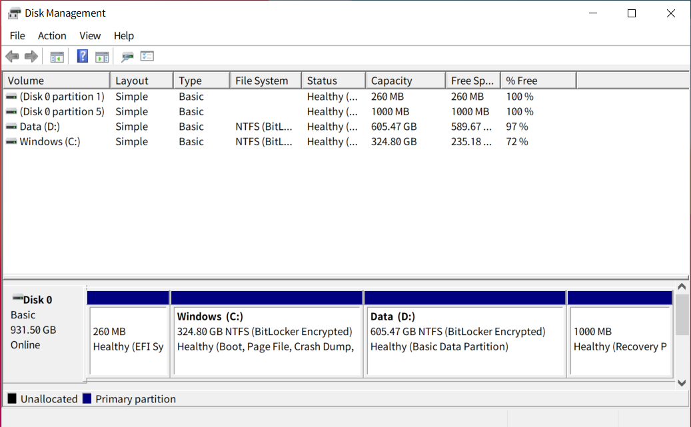

# はじめに

大学1年で買ったThinkPad T470sがへたってきたので、Black Friday割引でThinkPad T14s (2020)を買いました。備忘録も兼ねて、旧パソコンからどうやって環境移行したか書き留めたいと思います。

# Step 1: ソリティアを消す

とりあえず最初から入っている要らないアプリを消していきます。ThinkPadは基本的にメーカー側が入れてる不要なソフトがないため、Windows側が気を利かせて入れてくるソリティアやXboxをアンインストールします。

# Step 2: パーティションを分割する

次は主記憶装置をシステム用とデータ用の二つに分割します。今回はCrucial P5の1TB版が安くなってたので買いました（$100ちょい）。人によっては1つのドライブをパーティション分割しないこともあるとは思いますが、個人的にWindowsが壊れた時にデータごと消えると悲しいので分割します。方法は、"Win + X"を打ち込んで"K"を打つと"Disk Management"が開けるので、そこでいい感じに分割します。今回は合計930GB使えるようなので、システム用に325GB、データ用に605GB割り当てます。

# Step 3: ファイルの保存場所をデーだドライブに移す