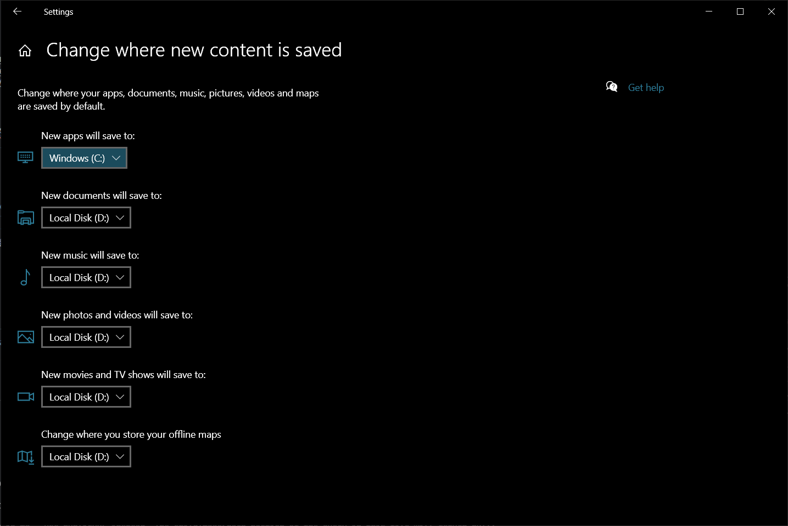

# はじめに

大学1年で買った[ThinkPad T470s](https://thehikaku.net/pc/lenovo/17ThinkPad-T470s.html)がへたってきたので、Black Friday割引で[ThinkPad T14 Gen 1](https://thehikaku.net/pc/lenovo/20ThinkPad-T14.html)を買いました。備忘録も兼ねて、旧パソコンからどうやって環境移行したか書き留めたいと思います。

# Step 1: ソリティアを消す

とりあえず最初から入っている要らないアプリを消します。ThinkPadは基本的にメーカー製ソフトが予め入っていないため、Windows側が気を利かせて入れてくるソリティアやXboxをアンインストールします。

# Step 2: パーティションを分割する

次は主記憶装置をシステム用とデータ用の2つに分割します。今回は[Crucial P5](https://www.amazon.com/Crucial-NAND-NVMe-Internal-3400MB/dp/B087QRVVVH)の1TB版が安くなってたので買いました（$100ちょい）。人によっては1つのドライブをパーティション分割しないこともあるとは思いますが、個人的にシステムファイルが壊れた時にデータも消えると悲しいので分割します。方法は、"Win + X"を打ち込んで"K"を打つと"Disk Management"が開けるので、そこでいい感じに分割します。今回は合計930GB使えたので、システム用に325GB、データ用に605GB割り当てました。

# Step 3: ファイルの保存場所をデータドライブに移す

今度はファイルの既定の保存場所をシステムドライブ（以下Cドライブ）からデータドライブ（以下Dドライブ）に変更します。"Win + S"を押して検索ボックスを表示して、そこで"Default save locations"と入力すると、設定画面を起動できます。

各項目の保存場所を選ぶことができるので、アプリ以外をすべてDドライブに保存します。