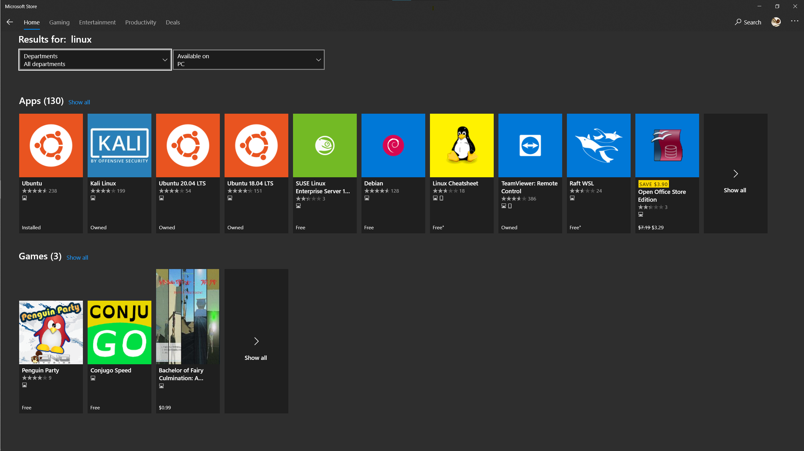

この記事は[前編](https://mikyu.bitbucket.io/blog/articles/my-reiwa-style-windows-setup-part1_ja)の続きです。

# 前回まで
[前回の記事](https://mikyu.bitbucket.io/blog/articles/my-reiwa-style-windows-setup-part1_ja)では新規インストールしたWindows側の設定やアプリのセットアップについてまとめました。今回はWindows Subsystem for Linux (WSL)側の設定をしたいと思います。「WSLとは何ぞ？」という方は[こちら](https://ja.wikipedia.org/wiki/Windows_Subsystem_for_Linux)の説明を見てもらえればと思います。簡単に説明するとLINUX系OSをWindows上でネイティブ実行させる仕組みです。自分の場合は研究やプログラミングで重宝してます。この記事ではWSL2について扱います（WSL1との違いは[Microsoftの説明](https://docs.microsoft.com/ja-jp/windows/wsl/compare-versions)が詳しいですが、WSL2はLINUXと完全に互換性があります）。

# Step 1: 必要な機能を有効化する
まずWSLを実行する下準備として、必要な機能を有効化する必要があります。Windowsボタンを押して"Turn Windows features on or off"と入力すると、検索結果に機能を追加するアプリが出てくると思います。それを起動して、
- Virtual Machine Platform
- Windows Hypervisor Platform
- Windows Subsystem for Linux

の三項目をチェックします。


全部チェックして"OK"を押すと再起動を促されると思うので再起動します。大抵のBIOSでは仮想化が有効化されてるはずですが、この後の操作でエラーが出たら、ちゃんと仮想化が有効化されているか確認しましょう。

# Step 2: デフォルトのWSLのバージョンを設定する
次に、既定で使われるWSLのバージョン（1か2）を設定します。今回は2にします。

```PowerShell
PS C:\Users\user> wsl --set-default-version 2
```
# Step 3: ディストリビューションをダウンロードする
これでデフォルトのバージョンが2になったので次はディストリビューションを入れます。一番簡単なのはMicrosoft Storeからダウンロードする方法ですが、好みのディストリビューションのappxパッケージからインストールすることもできます（[リンク](https://docs.microsoft.com/ja-jp/windows/wsl/install-manual)）。今回は素直にMicrosoft StoreからUbuntuを入れたいと思います。



インストール後の初回起動時にユーザー名とパスワード設定を促されるのでダイアログに従って設定します。

# Step 4: GUIアプリを使えるようにする
この段階まで来ると残りは個々のアプリのインストールやシェルの設定になるとは思いますが、Graphical User Interface (GUI) アプリの設定はなかなか嵌りどころなので書き留めたいと思います。今年の9月頃にMicrosoftが公式に[WSL2でのGUIサポートを発表](https://devblogs.microsoft.com/commandline/whats-new-in-the-windows-subsystem-for-linux-september-2020/)しましたが未だに実装されてません。そこで現状GUIアプリを動かそうとするとXサーバーを入れる必要があり少しトリッキーなのですが、今回は比較的に設定が楽な[GWSL](https://opticos.github.io/gwsl/)というXサーバーを使います。まずzshを使っている場合は以下のコマンドを.zshrcに追加して再読み込みします。

```
export DISPLAY=$(cat /etc/resolv.conf | grep nameserver | awk '{print $2}'):0
```
そしてMicrosoft StoreからGWSLをダウンロードして起動後、この[マニュアル](https://opticos.github.io/gwsl/tutorials/manual.html#installing-gwsl)通りにファイアウォール設定をします（デフォルトでOK）。そうすると画面の右下に設定メニューが現れるので、"GWSL Distro Tools"をクリックして一番上にある"Distro is Set to Auto-Export"をクリックします。これで使えるようになっているはずなので`xeyes`やその他のGUIアプリで使えるかテストします。

# 補足
もし前使っていたWSLの環境がある場合はエクスポートしてそのまま新環境にインストールできます。具体的な手順は[「窓の杜」](https://forest.watch.impress.co.jp/docs/serial/yajiuma/1220926.html)で詳しく説明されています。

主なセットアップは大体こんなものです。WindowsでフルにLinuxが使えるようになるなんていい時代ですよね。今後もGPU対応やGUI公式実装など予定されているので楽しみです。